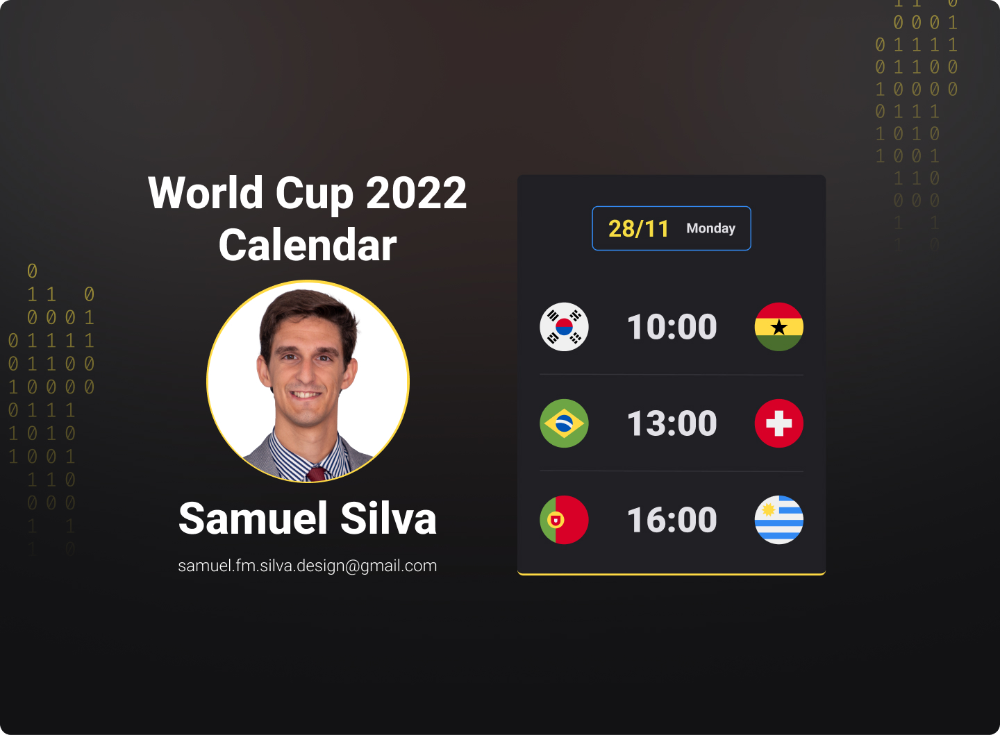

<h1 align="center"> World Cup 2022 </h1>

Project developed in a week in the Rocketseat course.

  <a href="#-tecnologias">Technologies</a>&nbsp;&nbsp;&nbsp;|&nbsp;&nbsp;&nbsp;
  <a href="#-projeto">Projet</a>&nbsp;&nbsp;&nbsp;|&nbsp;&nbsp;&nbsp;
  <a href="#-layout">Layout</a>&nbsp;&nbsp;&nbsp;|&nbsp;&nbsp;&nbsp;
  <a href="#memo-licença">License</a>

  

 

  

## 🚀 Technologies

This project was developed with the following technologies:

- HTML5 and CSS3
- JavaScript
- Git and Github

## 💻 Projet

The World Cup Calendar is a project that shows the games of the 2022 World Cup.

## 🔖 Layout

You can view the project layout through [THIS LINK](https://www.figma.com/file/J1Z33MISC22YZB8wfxiIns/NLW-Copa-Explorer/duplicate). It is necessary to have an account [Figma](https://figma.com) to access it.

## :memo: License

This project is under the MIT license.

---

Developed by Samuel Silva
